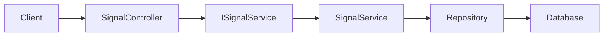
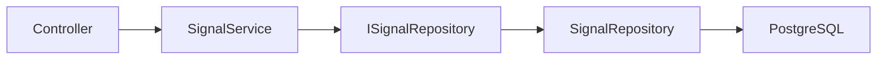
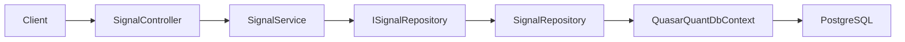

# Application Services in QuasarQuant

## Purpose

An application service coordinates one use case in the application.

For the signals feature, the use case is:

> Get the latest trading signal for a symbol.

The application service sits between the API controller and the parts of the system that store or generate data.



## Project Location

Application services belong in:

```text
src/QuasarQuant.Application/
```

For the signals feature, use:

```text
src/QuasarQuant.Application/Signals/ISignalService.cs
src/QuasarQuant.Application/Signals/SignalService.cs
```

The intended project structure is:

```text
src/
├── QuasarQuant.API/
│   └── Controllers/
│       └── SignalController.cs
├── QuasarQuant.Application/
│   └── Signals/
│       ├── ISignalService.cs
│       └── SignalService.cs
├── QuasarQuant.Core/
│   └── Models/
│       └── SignalResponse.cs
└── QuasarQuant.Infrastructure/
    └── Signals/
        └── SignalRepository.cs
```

The application layer should contain use-case logic. It should not directly contain HTTP details or database-specific code.

## Responsibilities by Layer

### API layer

Location: `src/QuasarQuant.API/`

The API layer handles HTTP concerns:

- Receives requests such as `GET /api/signal/AAPL`
- Reads route and query parameters
- Performs basic request validation
- Calls the application service
- Returns HTTP responses such as `200 OK`, `400 Bad Request`, and `404 Not Found`

The controller should not know how PostgreSQL, Redis, or the Python ML service works.

### Application layer

Location: `src/QuasarQuant.Application/`

The application layer handles the use case:

- Normalises the symbol
- Coordinates repositories and external service clients
- Applies application-level rules
- Retrieves the latest signal
- Decides which data source should be used

It should not depend on ASP.NET controller types such as `ControllerBase` or `IActionResult`.

### Core layer

Location: `src/QuasarQuant.Core/`

The Core layer contains concepts shared by other layers:

- Domain models
- Business rules
- Enums and value objects
- Domain-level interfaces when appropriate

`TradeSignal` belongs here because it represents a trading signal, not an HTTP response.

### Infrastructure layer

Location: `src/QuasarQuant.Infrastructure/`

The Infrastructure layer communicates with external systems:

- PostgreSQL
- Redis
- The Python FastAPI ML service
- External market-data providers

For example, a signal repository could query PostgreSQL for the latest stored signal.

## Signal Service Contract

`ISignalService.cs` describes what the application service can do:

```csharp
using QuasarQuant.Core.Models;

namespace QuasarQuant.Application.Signals;

public interface ISignalService
{
    Task<TradeSignal?> GetLatestAsync(
        string symbol,
        CancellationToken cancellationToken);
}
```

The nullable return type means that no signal may exist for the requested symbol.

The interface is useful because the controller depends on a capability rather than a specific implementation. Tests can provide a fake service without requiring a database or ML service.

## Signal Service Implementation

`SignalService.cs` contains the use-case logic:

```csharp
using QuasarQuant.Core.Models;

namespace QuasarQuant.Application.Signals;

public class SignalService : ISignalService
{
    public Task<TradeSignal?> GetLatestAsync(
        string symbol,
        CancellationToken cancellationToken)
    {
        // Later, retrieve the latest signal from a repository.
        return Task.FromResult<TradeSignal?>(null);
    }
}
```

Returning `null` is acceptable as a temporary placeholder while the repository and database are not implemented. The service should eventually call an abstraction such as `ISignalRepository` rather than querying the database directly.

## Controller Flow

The controller should translate between HTTP and the application service:

```csharp
using Microsoft.AspNetCore.Mvc;
using QuasarQuant.Application.Signals;
using QuasarQuant.Core.Models;

namespace QuasarQuant.API.Controllers;

[Route("api/[controller]")]
[ApiController]
public class SignalController : ControllerBase
{
    private readonly ISignalService signalService;

    public SignalController(ISignalService signalService)
    {
        this.signalService = signalService;
    }

    [HttpGet("{symbol}")]
    public async Task<ActionResult<TradeSignal>> GetSignal(
        string symbol,
        CancellationToken cancellationToken)
    {
        if (string.IsNullOrWhiteSpace(symbol))
        {
            return BadRequest("A symbol is required.");
        }

        var signal = await signalService.GetLatestAsync(
            symbol.Trim().ToUpperInvariant(),
            cancellationToken);

        if (signal is null)
        {
            return NotFound();
        }

        return Ok(signal);
    }
}
```

## Request Data Flow

1. A client sends `GET /api/signal/AAPL`.
2. `SignalController` receives the HTTP request.
3. The controller validates the route value.
4. The controller normalises `AAPL` and calls `ISignalService`.
5. `SignalService` retrieves the latest signal through a repository or another application dependency.
6. The controller converts the result into an HTTP response.

Typical responses are:

| Situation | Response |
|---|---|
| Symbol is missing or invalid | `400 Bad Request` |
| Signal exists | `200 OK` with the signal |
| No signal exists | `404 Not Found` |
| Unexpected dependency failure | Usually handled by application-wide error handling as `500 Internal Server Error` |

## Dependency Injection

Register the implementation in `Program.cs`:

```csharp
builder.Services.AddScoped<ISignalService, SignalService>();
```

`AddScoped` creates one service instance per HTTP request. This is a suitable default for services that may depend on request-scoped database contexts later.

The API project must reference both the Application and Core projects. The Application project must also reference Core:

```text
QuasarQuant.API -> QuasarQuant.Application -> QuasarQuant.Core
QuasarQuant.Infrastructure -> QuasarQuant.Application
QuasarQuant.Infrastructure -> QuasarQuant.Core
```

The API should normally not depend directly on Infrastructure implementation classes. Dependency injection wires the concrete implementations at the application boundary.

## What Should Not Go in the Controller?

Avoid placing these responsibilities in `SignalController`:

- SQL queries
- Redis commands
- HTTP calls to the Python ML service
- Decisions about signal freshness
- Complex trading rules
- Portfolio calculations
- Data-access error handling

Those responsibilities belong in the application or infrastructure layers. Keeping the controller small makes it easier to test and change.

## Recommended Next Steps

1. Add `QuasarQuant.Application.csproj`.
2. Add a project reference from the API to the Application project.
3. Add a project reference from the Application project to the Core project.
4. Define `ISignalService` in `Signals/ISignalService.cs`.
5. Implement `SignalService` in `Signals/SignalService.cs`.
6. Register the service in `Program.cs`.
7. Inject `ISignalService` into `SignalController`.
8. Add an `ISignalRepository` abstraction.
9. Implement the repository in `QuasarQuant.Infrastructure`.
10. Add unit tests for the service and controller behavior.

Start with an in-memory or placeholder implementation. Connect PostgreSQL, Redis, and the Python ML service only after the application flow is compiling and tested.

## Design Question to Ask for Each Piece of Code

When deciding where logic belongs, ask:

> Is this logic about HTTP, application behavior, domain rules, or external infrastructure?

| Logic | Location |
|---|---|
| Read a route parameter | API controller |
| Return `404 Not Found` | API controller |
| Decide whether a signal is still valid | Application service |
| Query PostgreSQL | Infrastructure repository |
| Call the Python ML API | Infrastructure client |
| Represent a trading signal | Core model |

## Why the Service Temporarily Returns `null`

The current service may return `null` while the repository and database are not implemented:

```csharp
public Task<TradeSignal?> GetLatestAsync(
    string symbol,
    CancellationToken cancellationToken)
{
    return Task.FromResult<TradeSignal?>(null);
}
```

The `?` in `TradeSignal?` means that the result is allowed to be missing. There are two possible outcomes:

```text
Signal found     -> TradeSignal object
Signal not found -> null
```

The controller translates those outcomes into HTTP responses:

```text
TradeSignal -> 200 OK
null        -> 404 Not Found
```

This placeholder allows the controller, application service, and project references to compile before PostgreSQL or another data source exists.

## The Repository Abstraction

A repository provides the application with a way to access stored data. The application layer defines the capability it needs without depending on database-specific code:

```csharp
using QuasarQuant.Core.Models;

namespace QuasarQuant.Application.Signals;

public interface ISignalRepository
{
    Task<TradeSignal?> GetLatestAsync(
        string symbol,
        CancellationToken cancellationToken);
}
```

This interface says that a signal repository can retrieve the latest signal. It does not say whether the data comes from PostgreSQL, Redis, an API, or a test double.

## Why the Service Should Not Query the Database Directly

If `SignalService` directly opened database connections and wrote SQL, it would have two responsibilities:

1. Coordinate the signal use case.
2. Understand PostgreSQL and data-access details.

Separating those responsibilities gives this flow:



`SignalService` handles application behavior, while `SignalRepository` handles database behavior.

## Future Service Implementation

Once `ISignalRepository` exists, `SignalService` can receive it through dependency injection:

```csharp
using QuasarQuant.Core.Models;

namespace QuasarQuant.Application.Signals;

public class SignalService : ISignalService
{
    private readonly ISignalRepository signalRepository;

    public SignalService(ISignalRepository signalRepository)
    {
        this.signalRepository = signalRepository;
    }

    public async Task<TradeSignal?> GetLatestAsync(
        string symbol,
        CancellationToken cancellationToken)
    {
        var normalizedSymbol = symbol.Trim().ToUpperInvariant();

        return await signalRepository.GetLatestAsync(
            normalizedSymbol,
            cancellationToken);
    }
}
```

The service depends on `ISignalRepository`, not the concrete `SignalRepository`. This means the storage strategy can change without changing the service's use-case contract:

```text
Today:  SignalService -> temporary placeholder
Later:  SignalService -> PostgreSQL repository
Future: SignalService -> Redis cache -> PostgreSQL repository
```

## Repository Implementation Location

The repository interface belongs with the application contract:

```text
src/QuasarQuant.Application/Signals/ISignalRepository.cs
```

The PostgreSQL implementation belongs in Infrastructure:

```text
src/QuasarQuant.Infrastructure/Signals/SignalRepository.cs
```

The Infrastructure implementation can contain SQL, Entity Framework Core, connection strings, and database mapping. Those details should not leak into the controller or application service.

## Why Interfaces Help Testing

Tests can provide a fake repository without starting PostgreSQL:

```csharp
public class FakeSignalRepository : ISignalRepository
{
    public Task<TradeSignal?> GetLatestAsync(
        string symbol,
        CancellationToken cancellationToken)
    {
        return Task.FromResult<TradeSignal?>(
            new TradeSignal
            {
                symbol = symbol,
                signal = "BUY",
                confidence = 0.87
            });
    }
}
```

This allows a test to focus on the application's signal behavior instead of requiring a live database.

## Responsibility Checklist

| Question | Responsible component |
|---|---|
| What did the HTTP client request? | Controller |
| What should happen for this use case? | Application service |
| How can a stored signal be retrieved? | Repository interface |
| How does the application communicate with PostgreSQL? | Infrastructure repository |
| What data represents a signal? | Core model |

The key separation is:

```text
Application service: what the application needs
Repository: how stored data is accessed
```

## Refined Understanding of the Signal Feature

The signal feature follows this request flow:



### Controller

`SignalController` exposes the signal-related HTTP endpoints. It receives the request, validates basic input, calls `SignalService`, and converts the result into an HTTP response.

It should not contain SQL queries, PostgreSQL connection code, or complex signal-processing rules.

### Application service

`SignalService` coordinates the `GetLatestSignal` use case. It can normalise the symbol, call `ISignalRepository`, apply application rules, and return the result.

The service should coordinate focused components rather than become a class that contains every kind of logic in the application.

### Repository

`ISignalRepository` defines the data-access capability required by the application. `SignalRepository` in Infrastructure implements that interface.

The repository uses EF Core to retrieve data. It should normally receive a `DbContext` through dependency injection rather than manually creating a PostgreSQL connection.

```text
SignalRepository
    -> QuasarQuantDbContext
        -> EF Core
            -> PostgreSQL
```

### Model, ORM, and database

`TradeSignal` is a C# entity or domain model. It describes the data associated with a trading signal, including properties such as `symbol`, `signal`, and `confidence`.

`TradeSignal` is not the ORM itself. EF Core is the ORM, which means Object-Relational Mapper. EF Core maps C# objects to relational database tables and translates LINQ queries into SQL.

The roles are:

| Concept | Role |
|---|---|
| `TradeSignal` | C# model/entity representing a signal |
| EF Core | ORM that maps C# objects to database data |
| `QuasarQuantDbContext` | EF Core entry point for querying and saving entities |
| PostgreSQL | Database that stores the actual rows |
| Primary key | Uniquely identifies one row, such as a signal `Id` |
| Foreign key | Links one table/entity to another, such as a signal to a portfolio |

Conceptually, EF Core may map the model like this:

```text
TradeSignal class  ->  trade_signals table
id                 ->  id column
symbol             ->  symbol column
portfolioId        ->  portfolio_id column
```

EF Core can infer some conventions, such as common primary-key names. Relationships and foreign keys may need explicit configuration in `OnModelCreating` or with attributes.

### Complete data flow

The data moves in both directions during a request:

```text
Client request
    -> Controller
        -> Application service
            -> Repository abstraction
                -> Repository implementation
                    -> EF Core DbContext
                        -> PostgreSQL

PostgreSQL result
    -> DbContext
        -> Repository
            -> Application service
                -> Controller
                    -> HTTP response
```

The refined summary is:

> `SignalController` exposes HTTP endpoints and delegates use cases to `SignalService`. `SignalService` coordinates application behavior through abstractions such as `ISignalRepository`. `SignalRepository` implements database access using EF Core and a PostgreSQL-backed `DbContext`. `TradeSignal` represents the signal data, while EF Core performs the object-to-relational mapping.

This separation means each layer has one main reason to change:

| Layer | Main reason to change |
|---|---|
| API | HTTP routes or response behavior change |
| Application | Signal use-case rules change |
| Infrastructure | PostgreSQL, Redis, or external-service details change |
| Core | Domain concepts or relationships change |

## Starting the Project

The repository currently contains two runnable .NET web projects:

- API: `src/QuasarQuant.API/`
- Blazor Web app: `src/QuasarQuant.Web/`

Start the API from the repository root:

```bash
dotnet run --project src/QuasarQuant.API/QuasarQuant.API.csproj
```

The API launch profiles use:

```text
HTTP:  http://localhost:5272
HTTPS: https://localhost:7154
```

Test the hardcoded signals at:

```text
http://localhost:5272/api/signal/AAPL
http://localhost:5272/api/signal/MSFT
```

Start the Blazor Web app in a second terminal:

```bash
dotnet run --project src/QuasarQuant.Web/QuasarQuant.Web.csproj
```

The Web launch profiles use:

```text
HTTP:  http://localhost:5013
HTTPS: https://localhost:7181
```

To build every project without starting a server:

```bash
dotnet build QuasarQuant.slnx
```

The API and Web app are separate processes at this stage. The Web app does not yet call the API automatically; that integration can be added later with an HTTP client.

## Temporary In-Memory Repository

While the database is still being designed, the Infrastructure project can provide a hardcoded repository implementation. This allows the API and controllers to be tested without PostgreSQL, EF Core migrations, or connection strings.

The current implementation is:

```text
src/QuasarQuant.Infrastructure/Signals/InMemorySignalRepository.cs
```

It implements the same `ISignalRepository` interface that a future PostgreSQL repository will implement. The service and controller therefore do not need to change when the data source changes.

The current hardcoded behavior is:

| Request | Result |
|---|---|
| `GET /api/signal/AAPL` | `200 OK` with a sample `BUY` signal |
| `GET /api/signal/MSFT` | `200 OK` with a sample `HOLD` signal |
| Any other symbol | `404 Not Found` |
| Empty symbol | `400 Bad Request` from the controller |

The dependency-injection registration is in `QuasarQuant.API/Program.cs`:

```csharp
builder.Services.AddScoped<ISignalService, SignalService>();
builder.Services.AddSingleton<ISignalRepository, InMemorySignalRepository>();
```

`InMemorySignalRepository` is registered as a singleton because it currently has no per-request state and does not use a database context. When it is replaced with an EF Core repository, the lifetime will normally be scoped to match the injected `DbContext`.

## Replacing It with PostgreSQL Later

When PostgreSQL is ready, create a `SignalRepository` in:

```text
src/QuasarQuant.Infrastructure/Signals/SignalRepository.cs
```

Make it implement `ISignalRepository`, inject `QuasarQuantDbContext`, and replace the registration:

```csharp
builder.Services.AddScoped<ISignalRepository, SignalRepository>();
```

The controller and `SignalService` should continue using `ISignalRepository`. This is the benefit of depending on an abstraction: changing storage does not require changing the HTTP endpoint.

The temporary repository is suitable for endpoint design and controller testing. It is not a substitute for production persistence because its data disappears when the application stops and it cannot store newly generated signals.
