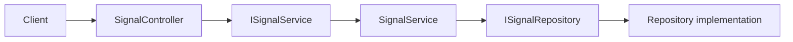

# Application Services

An application service coordinates one use case. In simple terms, it receives a request from the API layer, applies application rules, and asks other components for the data or work it needs.

## Signal request flow



The controller translates HTTP into an application call. The service coordinates the use case. The repository handles storage details. See [Repositories and Data Access](REPOSITORIES_AND_DATA_ACCESS.md) for the storage boundary.

## Project location

Application services belong in `src/QuasarQuant.Application/`.

Current signal files:

- `Signals/ISignalService.cs` defines the service capability.
- `Signals/SignalService.cs` implements the signal use cases.
- `Signals/ISignalRepository.cs` defines the data capability needed by the service.

## Service contract

```csharp
public interface ISignalService
{
    Task<TradeSignal?> GetLatestAsync(
        string symbol,
        CancellationToken cancellationToken);

    Task<IReadOnlyList<TradeSignal>> GetLatestBatchAsync(
        IEnumerable<string> symbols,
        CancellationToken cancellationToken);
}
```

The nullable single-result return means that no signal may exist. The batch operation returns the signals that are available after the controller normalises the input.

## Responsibilities by layer

| Layer | Responsibility | Example |
|---|---|---|
| API | HTTP input and output | Route values, status codes, request binding |
| Application | Use-case coordination | Normalise symbols, choose dependencies, apply freshness rules |
| Core | Shared domain concepts | `TradeSignal`, domain rules, value objects |
| Infrastructure | External systems | PostgreSQL, Redis, ML HTTP client, market-data providers |

The controller should not contain SQL, Redis commands, ML calls, or complex trading rules. The service should not depend on `ControllerBase`, `IActionResult`, or database-specific APIs.

## Dependency injection

Register the service at the application boundary:

```csharp
builder.Services.AddScoped<ISignalService, SignalService>();
```

`AddScoped` creates one instance per HTTP request and is a suitable default when a service may later use a request-scoped `DbContext`.

The API depends on the application contract, while Infrastructure supplies implementations at startup:

```text
QuasarQuant.API -> QuasarQuant.Application -> QuasarQuant.Core
QuasarQuant.Infrastructure -> QuasarQuant.Application
QuasarQuant.Infrastructure -> QuasarQuant.Core
```

## Testing boundary

Tests can replace `ISignalRepository` or `ISignalService` with a fake implementation. This keeps unit tests focused on use-case behavior without requiring PostgreSQL, Redis, or the ML service to be running.

Useful cases include:

- A known symbol returns a signal.
- An unknown symbol returns no signal.
- Symbols are trimmed and normalised consistently.
- A batch request removes duplicates and ignores blank values.
- A dependency cancellation is respected.

When a decision changes the responsibility of a layer, update this document and the more specific document that owns the affected detail.
