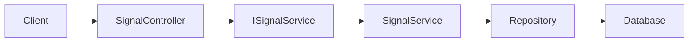

# Application Services in QuasarQuant

## Purpose

An application service coordinates one use case in the application.

For the signals feature, the use case is:

> Get the latest trading signal for a symbol.

The application service sits between the API controller and the parts of the system that store or generate data.



## Project Location

Application services belong in:

```text
src/QuasarQuant.Application/
```

For the signals feature, use:

```text
src/QuasarQuant.Application/Signals/ISignalService.cs
src/QuasarQuant.Application/Signals/SignalService.cs
```

The intended project structure is:

```text
src/
├── QuasarQuant.API/
│   └── Controllers/
│       └── SignalController.cs
├── QuasarQuant.Application/
│   └── Signals/
│       ├── ISignalService.cs
│       └── SignalService.cs
├── QuasarQuant.Core/
│   └── Models/
│       └── SignalResponse.cs
└── QuasarQuant.Infrastructure/
    └── Signals/
        └── SignalRepository.cs
```

The application layer should contain use-case logic. It should not directly contain HTTP details or database-specific code.

## Responsibilities by Layer

### API layer

Location: `src/QuasarQuant.API/`

The API layer handles HTTP concerns:

- Receives requests such as `GET /api/signal/AAPL`
- Reads route and query parameters
- Performs basic request validation
- Calls the application service
- Returns HTTP responses such as `200 OK`, `400 Bad Request`, and `404 Not Found`

The controller should not know how PostgreSQL, Redis, or the Python ML service works.

### Application layer

Location: `src/QuasarQuant.Application/`

The application layer handles the use case:

- Normalises the symbol
- Coordinates repositories and external service clients
- Applies application-level rules
- Retrieves the latest signal
- Decides which data source should be used

It should not depend on ASP.NET controller types such as `ControllerBase` or `IActionResult`.

### Core layer

Location: `src/QuasarQuant.Core/`

The Core layer contains concepts shared by other layers:

- Domain models
- Business rules
- Enums and value objects
- Domain-level interfaces when appropriate

`TradeSignal` belongs here because it represents a trading signal, not an HTTP response.

### Infrastructure layer

Location: `src/QuasarQuant.Infrastructure/`

The Infrastructure layer communicates with external systems:

- PostgreSQL
- Redis
- The Python FastAPI ML service
- External market-data providers

For example, a signal repository could query PostgreSQL for the latest stored signal.

## Signal Service Contract

`ISignalService.cs` describes what the application service can do:

```csharp
using QuasarQuant.Core.Models;

namespace QuasarQuant.Application.Signals;

public interface ISignalService
{
    Task<TradeSignal?> GetLatestAsync(
        string symbol,
        CancellationToken cancellationToken);
}
```

The nullable return type means that no signal may exist for the requested symbol.

The interface is useful because the controller depends on a capability rather than a specific implementation. Tests can provide a fake service without requiring a database or ML service.

## Signal Service Implementation

`SignalService.cs` contains the use-case logic:

```csharp
using QuasarQuant.Core.Models;

namespace QuasarQuant.Application.Signals;

public class SignalService : ISignalService
{
    public Task<TradeSignal?> GetLatestAsync(
        string symbol,
        CancellationToken cancellationToken)
    {
        // Later, retrieve the latest signal from a repository.
        return Task.FromResult<TradeSignal?>(null);
    }
}
```

Returning `null` is acceptable as a temporary placeholder while the repository and database are not implemented. The service should eventually call an abstraction such as `ISignalRepository` rather than querying the database directly.

## Controller Flow

The controller should translate between HTTP and the application service:

```csharp
using Microsoft.AspNetCore.Mvc;
using QuasarQuant.Application.Signals;
using QuasarQuant.Core.Models;

namespace QuasarQuant.API.Controllers;

[Route("api/[controller]")]
[ApiController]
public class SignalController : ControllerBase
{
    private readonly ISignalService signalService;

    public SignalController(ISignalService signalService)
    {
        this.signalService = signalService;
    }

    [HttpGet("{symbol}")]
    public async Task<ActionResult<TradeSignal>> GetSignal(
        string symbol,
        CancellationToken cancellationToken)
    {
        if (string.IsNullOrWhiteSpace(symbol))
        {
            return BadRequest("A symbol is required.");
        }

        var signal = await signalService.GetLatestAsync(
            symbol.Trim().ToUpperInvariant(),
            cancellationToken);

        if (signal is null)
        {
            return NotFound();
        }

        return Ok(signal);
    }
}
```

## Request Data Flow

1. A client sends `GET /api/signal/AAPL`.
2. `SignalController` receives the HTTP request.
3. The controller validates the route value.
4. The controller normalises `AAPL` and calls `ISignalService`.
5. `SignalService` retrieves the latest signal through a repository or another application dependency.
6. The controller converts the result into an HTTP response.

Typical responses are:

| Situation | Response |
|---|---|
| Symbol is missing or invalid | `400 Bad Request` |
| Signal exists | `200 OK` with the signal |
| No signal exists | `404 Not Found` |
| Unexpected dependency failure | Usually handled by application-wide error handling as `500 Internal Server Error` |

## Dependency Injection

Register the implementation in `Program.cs`:

```csharp
builder.Services.AddScoped<ISignalService, SignalService>();
```

`AddScoped` creates one service instance per HTTP request. This is a suitable default for services that may depend on request-scoped database contexts later.

The API project must reference both the Application and Core projects. The Application project must also reference Core:

```text
QuasarQuant.API -> QuasarQuant.Application -> QuasarQuant.Core
QuasarQuant.Infrastructure -> QuasarQuant.Application
QuasarQuant.Infrastructure -> QuasarQuant.Core
```

The API should normally not depend directly on Infrastructure implementation classes. Dependency injection wires the concrete implementations at the application boundary.

## What Should Not Go in the Controller?

Avoid placing these responsibilities in `SignalController`:

- SQL queries
- Redis commands
- HTTP calls to the Python ML service
- Decisions about signal freshness
- Complex trading rules
- Portfolio calculations
- Data-access error handling

Those responsibilities belong in the application or infrastructure layers. Keeping the controller small makes it easier to test and change.

## Recommended Next Steps

1. Add `QuasarQuant.Application.csproj`.
2. Add a project reference from the API to the Application project.
3. Add a project reference from the Application project to the Core project.
4. Define `ISignalService` in `Signals/ISignalService.cs`.
5. Implement `SignalService` in `Signals/SignalService.cs`.
6. Register the service in `Program.cs`.
7. Inject `ISignalService` into `SignalController`.
8. Add an `ISignalRepository` abstraction.
9. Implement the repository in `QuasarQuant.Infrastructure`.
10. Add unit tests for the service and controller behavior.

Start with an in-memory or placeholder implementation. Connect PostgreSQL, Redis, and the Python ML service only after the application flow is compiling and tested.

## Design Question to Ask for Each Piece of Code

When deciding where logic belongs, ask:

> Is this logic about HTTP, application behavior, domain rules, or external infrastructure?

| Logic | Location |
|---|---|
| Read a route parameter | API controller |
| Return `404 Not Found` | API controller |
| Decide whether a signal is still valid | Application service |
| Query PostgreSQL | Infrastructure repository |
| Call the Python ML API | Infrastructure client |
| Represent a trading signal | Core model |
