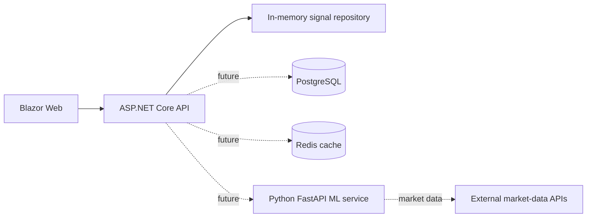
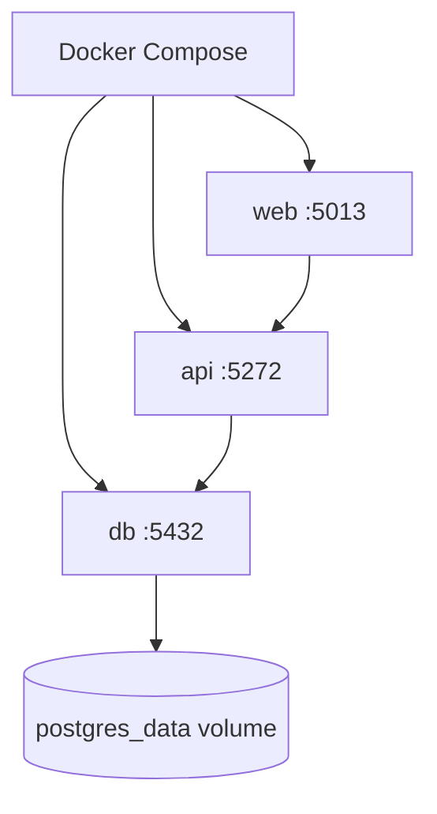
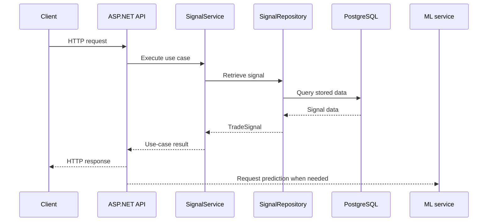

# Backend Infrastructure

This document explains how QuasarQuant runs as a set of local and future production components. It describes deployment responsibilities, not application business rules.

## Current component layout



Today, the API uses an in-memory repository. PostgreSQL, Redis, and the ML service are planned dependencies rather than active services in the current Compose file.

## Docker Compose

The current `docker-compose.yml` defines:

| Service | Responsibility | Local port |
|---|---|---|
| `db` | PostgreSQL database | `5432` |
| `api` | ASP.NET Core API | `5272` |
| `web` | Blazor Web application | `5013` |

The API waits for PostgreSQL to pass its health check. The Web application depends on the API container. Persistent database data is stored in the `postgres_data` volume.



Start the stack from the repository root:

```bash
docker compose up --build
```

Stop it with:

```bash
docker compose down
```

## Request and data flow



The last two database and ML interactions are future paths. The current path ends at `InMemorySignalRepository`.

## Planned responsibilities

- PostgreSQL is the durable system of record for users, portfolios, trades, market data, and backtest results.
- Redis is for short-lived or frequently requested data such as cached market data, predictions, and rate-limit state.
- The Python FastAPI service owns feature engineering, model loading, and inference.
- Nginx may later provide a single public entry point, TLS termination, and reverse proxying.
- GitHub Actions and a Linux VPS are future deployment infrastructure.

Infrastructure decisions should be recorded here. Use [MVP](MVP.md) for scope decisions and [ML Service](ML_SERVICE.md) for the Python service design.
