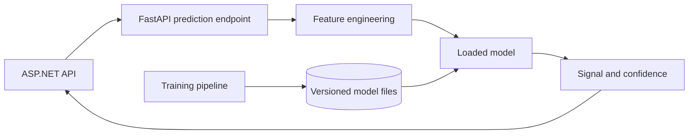

# Machine Learning Service

The ML component is planned as a separate Python FastAPI service. It should produce predictions, while the .NET application remains responsible for trading workflows, portfolios, and API composition.

## Responsibilities

- Ingest or receive historical market data.
- Build reproducible features such as SMA, EMA, RSI, MACD, returns, volatility, and volume indicators.
- Train and evaluate baseline models.
- Load versioned models for inference.
- Return `BUY`, `SELL`, or `HOLD` predictions with confidence and metadata.

The service should not own portfolio balances, trade execution, authentication, or the final user-facing workflow.

## Runtime flow

## Initial model strategy

Start with interpretable, testable models:

- Logistic Regression as a baseline.
- Random Forest Classifier as the first stronger baseline.
- Gradient Boosted Trees as an optional extension.

Deep learning, reinforcement learning, MLflow, and scheduled retraining are future work. They should wait until the data and evaluation pipeline is stable.

## Training pipeline

1. Read historical data and record the dataset window.
2. Generate the feature set.
3. Split by time rather than randomly shuffling observations.
4. Train the model.
5. Evaluate direction metrics and backtested strategy performance.
6. Store the model, feature-set definition, hyperparameters, and metrics together.

## Storage boundary

- PostgreSQL stores market data, dataset metadata, and backtest results.
- File storage initially holds trained model artifacts and feature definitions.
- A model registry may be added later if version management becomes difficult.

Keep ML design decisions here. Put API payload shape in [API Endpoints](API_ENDPOINTS.md), infrastructure wiring in [Backend Infrastructure](BACKEND_INFRASTRUCTURE.md), and product scope in [MVP](MVP.md).
