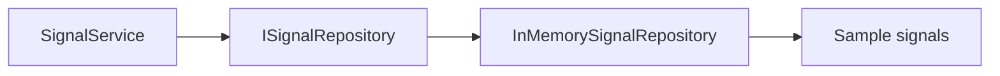
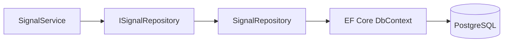

# Repositories and Data Access

A repository hides storage details from the application layer. In simple terms, the application asks for data through an interface, while Infrastructure decides whether that data comes from memory, PostgreSQL, Redis, or another system.

## Current signal path



The abstraction is defined in `src/QuasarQuant.Application/Signals/ISignalRepository.cs`. The temporary implementation is `src/QuasarQuant.Repository/Signals/InMemorySignalRepository.cs`.

## Contract

```csharp
public interface ISignalRepository
{
    Task<TradeSignal?> GetLatestAsync(
        string symbol,
        CancellationToken cancellationToken);
}
```

The batch operation follows the same idea through the application service and returns all available signals for the requested symbols.

## Planned PostgreSQL path



When PostgreSQL is introduced:

1. Add a `SignalRepository` implementation in `QuasarQuant.Repository/Signals/`.
2. Inject an EF Core `DbContext` into that repository.
3. Register it as scoped in `Program.cs`.
4. Keep the controller and `SignalService` dependent on interfaces.

Expected registration:

```csharp
builder.Services.AddScoped<ISignalRepository, SignalRepository>();
```

The current in-memory registration is a singleton because it has no request-scoped state:

```csharp
builder.Services.AddSingleton<ISignalRepository, InMemorySignalRepository>();
```

## Responsibilities

| Component | Responsibility |
|---|---|
| `ISignalRepository` | Describes the data capability the application needs |
| Repository implementation | Performs storage-specific reads and writes |
| EF Core `DbContext` | Maps C# models to relational data and executes queries |
| PostgreSQL | Stores durable rows |
| Redis | Optionally caches data around the durable store |

Do not put SQL, EF Core queries, connection strings, or Redis commands in controllers or application services. See [Application Services](APPLICATION_SERVICES.md) for the boundary between use-case logic and data access.
